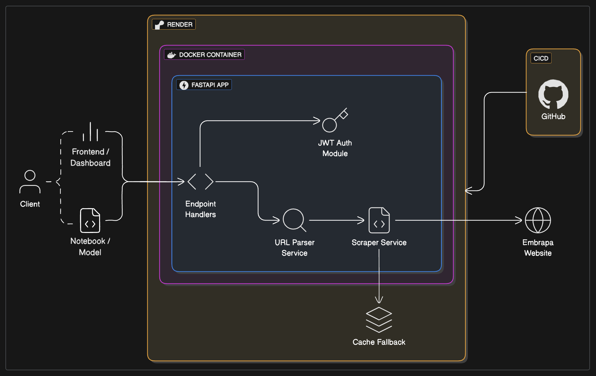

[](https://your-live-demo-url.com)

# Tech Challenge API

This is a FastAPI-based project designed to provide endpoints for authentication and data retrieval related to production, processing, and commercial activities. This project is part of a technical challenge and demonstrates the use of modern Python web development practices.

## Architecture Diagram



### Deployment

The project is deployed as a Docker container to Render, the integration with GitHub allows for automatic deployment on every push to the main branch.

### User Flow

1. **User Authentication**: The user sends a request to the `/login` endpoint with their credentials.
2. **Token Generation**: If the credentials are valid, a JWT token is generated and returned to the user.
3. **Data Retrieval**: The user can use the token to access protected `/embrapa` endpoints.
4. **Data Processing**: The data is processed and returned in a structured JSON format.

### Services

- **URL Parsing**: Responsible for constructing the URL to be requested and scrapped by the Scrapping service.
- **Scrapping**: Receives an URL for scrapping and returns the information in a JSON format.

### App Structure

The project is organized into the following directories:

| Directory        | Description                                                            |
|------------------|------------------------------------------------------------------------|
| **`api/`**       | Contains API routes, organized by version for better maintainability.  |
| **`core/`**      | Includes core application settings such as configuration and security. |
| **`schemas/`**   | Houses Pydantic models used for request and response validation.       |
| **`services/`**  | Implements business logic and integrates with external services.       |

This structure promotes modularity and makes the codebase easier to navigate and extend.

## Local Development

To run the project locally, ensure you have Docker and Docker Compose installed. Follow these steps:

1. Clone the repository:
```bash
gh repo clone <repository-url> && cd <repository-name>
```
2. Build and run the Docker container:
```bash
docker-compose up --build
```
3. Access the API at `http://localhost:8000`.
4. Use the Swagger UI at `http://localhost:8000/docs` to interact with the API.
5. Use the ReDoc UI at `http://localhost:8000/redoc` for API documentation.
